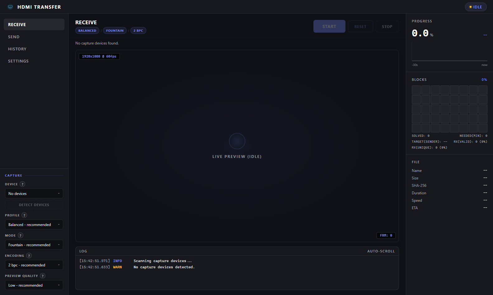
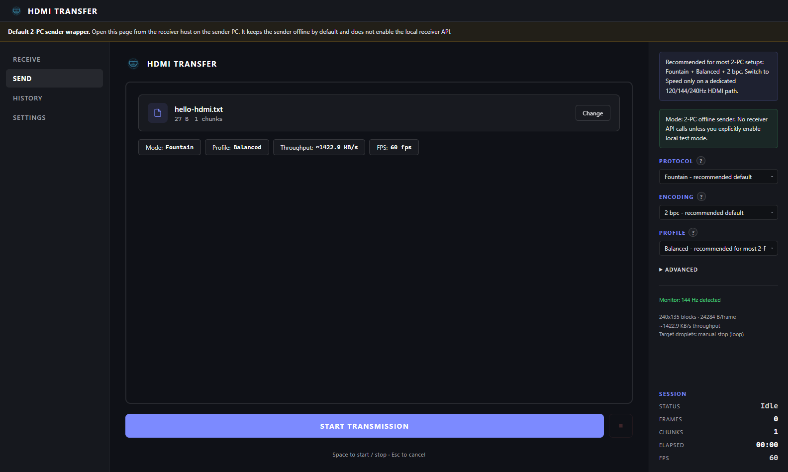
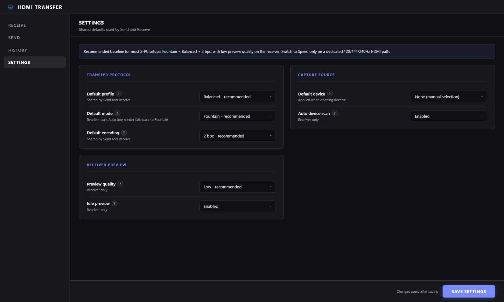

<p align="center">
  
</p>

# HDMI Transfer — File Transfer over HDMI

<p align="center"><strong>Turn a file into a video signal. Rebuild it on another computer with a capture card.</strong></p>

<p align="center">
  <a href="https://github.com/Thunzyy/HDMI-transfer/actions/workflows/ci.yml"></a>
  
  
  
</p>

<p align="center">
  <a href="#quick-start">Quick start</a> ·
  <a href="#screenshots">Screenshots</a> ·
  <a href="docs/getting-started.md">Installation guide</a> ·
  <a href="docs/hardware-setup.md">Hardware setup</a> ·
  <a href="#frequently-asked-questions">FAQ</a>
</p>

**HDMI Transfer** encodes files into video frames displayed through an HDMI output. On the receiving computer, an **HDMI-to-USB capture card** captures those frames so the software can reconstruct the original file. The file payload travels through video; no network file share is required.

A browser-based sender, a USB capture-card receiver, fountain codes and a local Python/Flask web interface work together to move files between two computers.

<p align="center">
  
</p>

## How it works

<p align="center">
  
</p>

1. **Choose** a file in the browser sender or through the command line.
2. **Display** the encoded frames full-screen on the HDMI output connected to the capture card.
3. **Receive** through the local interface, then download the reconstructed file.

> Connecting two PC HDMI outputs is not enough: the receiver needs a **video input**, usually provided by a USB capture card. See the [hardware guide](docs/hardware-setup.md).

## Screenshots

| Send | Configure |
| --- | --- |
| [](docs/images/sender.png) | [](docs/images/settings.png) |
| Choose a file, protocol and profile. | Adjust the settings in the local interface. |

Actual interface screenshots with no capture card connected: an idle receiver and a sample file ready to send. These are not throughput measurements or evidence of a completed hardware transfer. [Reproduce the screenshots](docs/images/README.md).

## Why HDMI Transfer?

- **Video transport**: move a file between two computers using HDMI and a USB capture card.
- **Standalone sender**: open `sender.html` locally in a browser, with no Python installation on the sending computer.
- **Browser-based reception**: select a capture device, preview the signal, track progress, download files and browse history.
- **Fountain codes**: reconstruct a file from enough packets, even when some video frames are lost.
- **Explicit settings**: choose Balanced, Speed or Quality profiles and configure the encoding.
- **CLI tools**: send, receive, calibrate and benchmark for reproducible experiments.

Built for demonstrations, video-channel experiments and authorized transfers in a controlled environment. Throughput depends on the entire HDMI chain; profile frame rates are targets, not guaranteed transfer speeds.

## Quick start

### Docker — one command

With Docker Engine or Docker Desktop running, from the cloned repository:

```bash
docker compose up --build -d --wait
```

Open **[http://localhost:5000](http://localhost:5000)**. No local Python or uv installation is needed. The first build downloads dependencies; later starts reuse the image. Received files are kept in a Docker volume.

```bash
docker compose stop    # Stop; keep received files
docker compose start  # Start again
```

This starts the web interface on Windows, macOS or Linux. **Physical HDMI reception also requires a capture device inside the container.** Use the [Linux capture-card setup](docs/docker.md#linux-capture-card) on native Linux; Docker Desktop does not automatically expose the host's USB capture card. For capture on Windows, the native launcher below is the simplest path.

See the [Docker guide](docs/docker.md) for device mapping, ports, LAN access, updates and the reproducible smoke test.

### Native installation

### 1. Prepare the receiving computer

Install [Git](https://git-scm.com/downloads) and [uv](https://docs.astral.sh/uv/getting-started/installation/), then open a terminal:

```bash
git clone https://github.com/Thunzyy/HDMI-transfer.git
cd HDMI-transfer
```

The repository is currently private: use an authorized GitHub account. [Cloning help](docs/getting-started.md#accès-au-dépôt).

### 2. Launch

**Windows — PowerShell or terminal:**

```powershell
.\start.bat
```

**Linux / macOS — shell:**

```bash
sh start.sh
```

The launchers install web dependencies into `.venv`, then start the server. The first launch requires access to dependency downloads. Open **[http://localhost:5000](http://localhost:5000)** and keep the terminal open. Stop the server with `Ctrl+C`.

Windows is the automated quality-gate platform. A POSIX launcher is provided for Linux/macOS; capture-card and driver compatibility must be checked on each system.

<details>
<summary>Manual commands, without a launcher</summary>

```bash
uv sync --locked --extra web
uv run --no-sync hdmi-web
```

</details>

### 3. Transfer your first file

1. Connect **sender PC HDMI output → capture card HDMI input → receiver PC USB port**.
2. Copy [`sender.html`](sender.html) to the sending computer using an authorized method, then open it in a browser. It runs in offline mode by default.
3. On the receiver, open **Receive**, choose the capture card and select **Fountain · Balanced · 2 bpc · Preview Low**.
4. On the sender, choose a small test file and match the receiver’s protocol, profile and encoding settings.
5. Move the sender window to the display connected to the capture card. Click **Start** on the receiver, then **Start transmission** on the sender. The signal must fill the captured display.
6. Once reception is complete, use **Download** on the receiver. Stop the sender if it is still transmitting.

**Need to load the sender over a LAN or test on a single PC?** The [step-by-step guide](docs/getting-started.md) covers both options, display settings and common problems.

## Choose your setup

| Goal | Setup |
| --- | --- |
| Two PCs with no shared network | Local `sender.html` + local web receiver |
| Load the sender from the receiver on a trusted LAN | Start the server with `--host 0.0.0.0`, then open `http://RECEIVER_IP:5000/sender` |
| Test on one PC with an HDMI capture card | `/sender/test` — explicit local test mode |
| Automate sending or receiving | [CLI commands](docs/getting-started.md#utilisation-en-ligne-de-commande) |

LAN mode uses the network to serve the interface. To avoid any network dependency between the two computers, prepare the standalone HTML file in advance. The local server exposes received files: restrict LAN access to a trusted network.

## Profiles

| Profile | Resolution | Target FPS | When to use it |
| --- | --- | ---: | --- |
| **Balanced** | 1920 × 1080 | 60 | Recommended for your first transfer |
| Speed | 1920 × 1080 | 240 | A high-refresh-rate HDMI path and compatible capture card |
| Quality | 3840 × 2160 | 30 | Experiments with a 4K-compatible chain |

Selecting Speed does not turn a 60 Hz capture card into a 240 Hz device. See [calibration and signal checks](docs/hardware-setup.md).

## Frequently asked questions

### Can I transfer files with just an HDMI cable between two computers?

The receiving computer needs an HDMI input. Most PC HDMI ports are outputs, so an HDMI-to-USB capture card is required.

### Do I need Internet access or a shared network?

Initial installation downloads dependencies. After setup, the file payload travels over HDMI. A local HTML sender and an already-installed receiver can operate without a shared network.

### Is the transfer encrypted?

Video encoding and fountain codes are not encryption. Encrypt the file before sending it if confidentiality is required.

### What throughput should I expect?

There is no universal transfer-speed claim: the GPU, browser, effective frame rate, video format, capture card and CPU all matter. Measure your own hardware; a software-only benchmark does not validate the physical chain.

### Why is the preview black, or why does decoding fail?

Check the capture source, close other applications using the card, verify the correct HDMI display and return to **Fountain + Balanced + 2 bpc** on both sides. See [troubleshooting](docs/getting-started.md#dépannage).

## Documentation and development

The Docker guide and `llms.txt` are in English; the other detailed guides are currently in French.

| Document | Contents |
| --- | --- |
| [Docker](docs/docker.md) | One-command startup, persistent storage, Linux capture devices and smoke tests |
| [Installation and quick start](docs/getting-started.md) | Prerequisites, two-PC setup, offline mode, LAN, CLI and troubleshooting |
| [Hardware and calibration](docs/hardware-setup.md) | Wiring, displays, capture devices and loopback testing |
| [Architecture](docs/architecture.md) | Code organization and responsibilities |
| [Testing](docs/testing.md) | Quality gate and hardware-testing boundaries |
| [Migration](docs/migration.md) | Source layout and compatibility |
| [Screenshots](docs/images/README.md) | Provenance and reproducible capture |
| [Assistant overview](llms.txt) | Project summary and source links |

```powershell
uv sync --locked --extra dev
uv run --no-sync powershell -ExecutionPolicy Bypass -File tools/run_quality_gate.ps1
```

The sender HTML is generated: edit `src/interfaces/browser_sender/`, then run `uv run python tools/build_sender_html.py`. Check for drift with `uv run python tools/build_sender_html.py --check`.

## License

There is currently no `LICENSE` file in the repository. Reuse terms remain to be specified by the author. This project is intended for education and authorized research.
