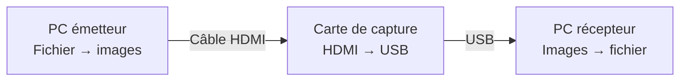

<p align="center">
  
</p>

# HDMI Transfer — Transfert de fichiers par HDMI

<p align="center"><strong>Un fichier devient un signal vidéo. Une carte de capture le reconstruit sur l’autre PC.</strong></p>

<p align="center">
  <a href="https://github.com/Thunzyy/HDMI-transfer/actions/workflows/ci.yml"></a>
  
  
  
</p>

<p align="center">
  <a href="#démarrage-rapide">Démarrer</a> ·
  <a href="#aperçu">Captures</a> ·
  <a href="docs/getting-started.md">Guide d’installation</a> ·
  <a href="docs/hardware-setup.md">Câblage</a> ·
  <a href="#questions-fréquentes">FAQ</a>
</p>

**HDMI Transfer** encode des fichiers en images affichées sur une sortie HDMI. Sur le PC destinataire, une **carte de capture HDMI vers USB** reçoit ces images et le logiciel reconstitue le fichier. Les données du fichier passent par la vidéo ; aucun partage réseau n’est nécessaire pour ce transport.

*HDMI file transfer with a browser-based sender, a USB capture-card receiver, fountain codes and a local Python/Flask web interface.*

<p align="center">
  
</p>

## Comment ça marche



1. **Choisir** un fichier dans le sender navigateur ou en ligne de commande.
2. **Afficher** les images encodées en plein écran sur la sortie reliée à la capture.
3. **Recevoir** depuis l’interface locale, puis télécharger le fichier reconstruit.

> Deux sorties HDMI de PC ne suffisent pas : le récepteur a besoin d’une **entrée vidéo**, généralement une carte de capture USB. Voir le [guide matériel](docs/hardware-setup.md).

## Aperçu

| Envoyer | Configurer |
| --- | --- |
| [](docs/images/sender.png) | [](docs/images/settings.png) |
| Sélection du fichier, protocole et profil. | Réglages disponibles depuis l’interface locale. |

Captures réelles de l’interface, sans carte connectée : récepteur en attente et fichier d’exemple prêt à envoyer. Elles ne constituent pas une mesure de débit ni une preuve de transfert matériel. [Reproduire les captures](docs/images/README.md).

## Pourquoi HDMI Transfer ?

- **Transport vidéo** : déplacer un fichier entre deux machines par une liaison HDMI et une capture USB.
- **Émetteur autonome** : `sender.html` s’ouvre localement dans un navigateur, sans Python côté émetteur.
- **Réception dans le navigateur** : choix de la capture, aperçu, progression, téléchargement et historique.
- **Codes Fountain** : reconstruire à partir d’un nombre suffisant de paquets, même lorsque des images sont perdues.
- **Réglages explicites** : profils Balanced / Speed / Quality et choix de l’encodage.
- **Outils CLI** : émission, réception, calibration et benchmark pour les expérimentations reproductibles.

Destiné aux démonstrations, à l’étude des canaux vidéo et aux transferts autorisés dans un environnement maîtrisé. Le débit dépend de toute la chaîne HDMI ; les FPS d’un profil sont des cibles, pas un débit garanti.

## Démarrage rapide

### 1. Préparer le PC récepteur

Installer [Git](https://git-scm.com/downloads) et [uv](https://docs.astral.sh/uv/getting-started/installation/), puis ouvrir un terminal :

```bash
git clone https://github.com/Thunzyy/HDMI-transfer.git
cd HDMI-transfer
```

Le dépôt est actuellement privé : utiliser un compte GitHub autorisé. [Aide au clonage](docs/getting-started.md#accès-au-dépôt).

### 2. Lancer

**Windows — PowerShell ou terminal :**

```powershell
.\start.bat
```

**Linux / macOS — shell :**

```bash
sh start.sh
```

Les lanceurs installent les dépendances web dans `.venv`, puis démarrent le serveur. Le premier lancement nécessite un accès aux téléchargements des dépendances. Ouvrir **[http://localhost:5000](http://localhost:5000)** et garder le terminal ouvert. Arrêter avec `Ctrl+C`.

Windows est la plateforme du contrôle qualité automatisé. Le lanceur POSIX est fourni pour Linux/macOS ; la compatibilité de la carte et de ses pilotes doit être vérifiée sur chaque système.

<details>
<summary>Commandes manuelles, sans lanceur</summary>

```bash
uv sync --locked --extra web
uv run --no-sync hdmi-web
```

</details>

### 3. Effectuer le premier transfert

1. Relier **sortie HDMI du PC émetteur → entrée HDMI de la capture → USB du PC récepteur**.
2. Copier [`sender.html`](sender.html) sur le PC émetteur par un moyen autorisé, puis l’ouvrir dans un navigateur. Il fonctionne en mode offline par défaut.
3. Côté récepteur : ouvrir **Receive**, choisir la carte, puis sélectionner **Fountain · Balanced · 2 bpc · Preview Low**.
4. Côté émetteur : choisir un petit fichier de test et les mêmes paramètres de protocole, profil et encodage.
5. Placer le sender sur l’affichage envoyé à la capture, lancer la réception avec **Start**, puis cliquer **Start transmission** côté émetteur. Le signal doit occuper tout l’écran de capture.
6. À la fin, utiliser **Download** côté récepteur. Arrêter le sender si celui-ci continue à émettre.

**Besoin d’un sender accessible sur le LAN ou d’un test sur un seul PC ?** Le [guide pas à pas](docs/getting-started.md) détaille ces deux variantes, les réglages d’écran et les problèmes fréquents.

## Choisir son mode

| Besoin | Solution |
| --- | --- |
| Deux PC sans réseau commun | `sender.html` local + récepteur web local |
| Charger le sender depuis le récepteur sur un LAN de confiance | Serveur avec `--host 0.0.0.0`, puis `http://IP_DU_RECEPTEUR:5000/sender` |
| Tester la chaîne sur un seul PC avec capture HDMI | `/sender/test` — mode de test local explicite |
| Automatiser un envoi ou une réception | [Commandes CLI](docs/getting-started.md#utilisation-en-ligne-de-commande) |

Le mode LAN utilise le réseau pour servir l’interface. Pour ne dépendre d’aucun réseau entre les deux PC, préparer le fichier HTML autonome à l’avance. Le serveur local expose les fichiers reçus : réserver l’accès LAN à un réseau de confiance.

## Profils

| Profil | Résolution | FPS cibles | Point de départ |
| --- | --- | ---: | --- |
| **Balanced** | 1920 × 1080 | 60 | Recommandé pour un premier essai |
| Speed | 1920 × 1080 | 240 | Chaîne HDMI et capture compatibles haute fréquence |
| Quality | 3840 × 2160 | 30 | Essais avec une chaîne compatible 4K |

Une capture limitée à 60 Hz ne devient pas une capture 240 Hz en choisissant Speed. [Calibration et vérification du signal](docs/hardware-setup.md).

## Questions fréquentes

### Peut-on transférer avec un simple câble HDMI entre deux ordinateurs ?

Il faut une entrée HDMI côté réception. Sur la plupart des PC, le port HDMI est une sortie ; utiliser une carte de capture HDMI vers USB.

### Faut-il Internet ou un réseau commun ?

L’installation initiale télécharge des dépendances. Ensuite, le transport du fichier passe par HDMI. Un sender HTML local et un récepteur déjà installé peuvent être utilisés sans réseau commun.

### Le transfert est-il chiffré ?

L’encodage vidéo et les codes Fountain ne constituent pas un chiffrement. Chiffrer le fichier avant l’envoi si sa confidentialité l’exige.

### Quel débit attendre ?

Il n’y a pas de débit universel annoncé : GPU, navigateur, fréquence effective, format vidéo, carte de capture et CPU interviennent. Mesurer sur son propre matériel ; un benchmark logiciel seul ne valide pas la chaîne physique.

### La preview reste noire ou le décodage échoue ?

Vérifier la source de capture, fermer les autres logiciels qui utilisent la carte, contrôler le bon affichage HDMI et revenir à **Fountain + Balanced + 2 bpc** des deux côtés. Voir le [dépannage](docs/getting-started.md#dépannage).

## Documentation et développement

| Document | Contenu |
| --- | --- |
| [Installer et démarrer](docs/getting-started.md) | Prérequis, deux PC, mode offline, LAN, CLI, dépannage |
| [Matériel et calibration](docs/hardware-setup.md) | Câblage, écrans, capture et test loopback |
| [Architecture](docs/architecture.md) | Organisation et responsabilités du code |
| [Tests](docs/testing.md) | Contrôle qualité et limites des tests matériels |
| [Migration](docs/migration.md) | Organisation des sources et compatibilité |
| [Captures](docs/images/README.md) | Provenance et génération reproductible |
| [Résumé pour assistants](llms.txt) | Vue d’ensemble et liens vers les sources |

```powershell
uv sync --locked --extra dev
uv run --no-sync powershell -ExecutionPolicy Bypass -File tools/run_quality_gate.ps1
```

Le sender HTML est généré : modifier `src/interfaces/browser_sender/`, puis exécuter `uv run python tools/build_sender_html.py`. Vérifier sa cohérence avec `uv run python tools/build_sender_html.py --check`.

## Licence

Aucun fichier `LICENSE` n’est actuellement présent dans le dépôt. Les conditions de réutilisation restent à préciser par l’auteur. Projet destiné à l’éducation et à la recherche autorisée.
