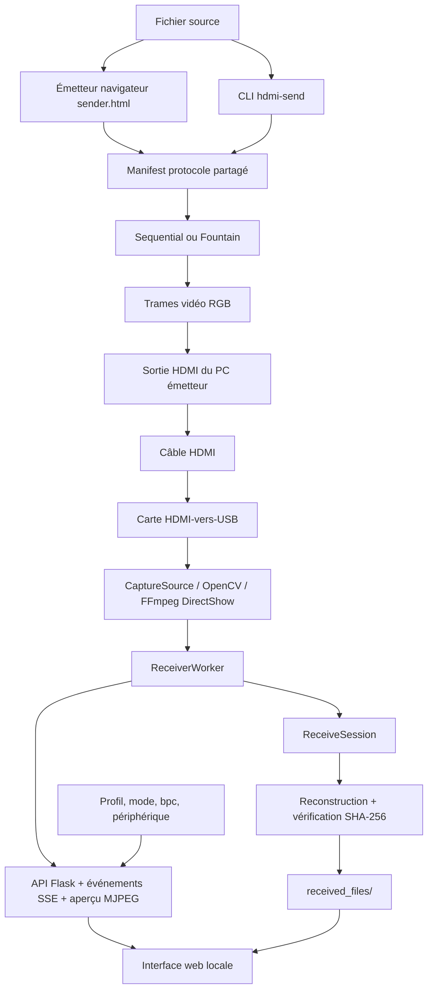
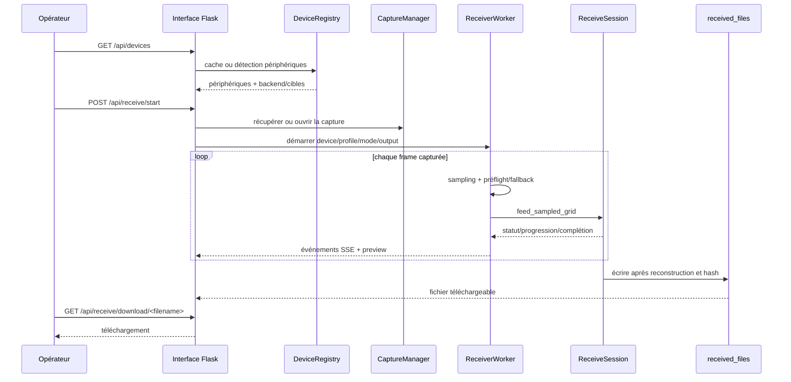

# Architecture — HDMI Transfer

## Objectif et périmètre

HDMI Transfer est un proof of concept expérimental de transfert de fichiers par signal vidéo HDMI. Un émetteur transforme un fichier en trames vidéo; un ordinateur récepteur capture ces trames avec une carte HDMI-vers-USB, les décode et reconstruit le fichier. Le contenu du fichier ne passe pas par un partage réseau pendant le transfert.

Le dépôt fournit plusieurs surfaces autour du même moteur :

- `sender.html`, émetteur navigateur autonome utilisable hors ligne;
- une interface web Flask pour détecter la carte, prévisualiser le signal, piloter une réception, afficher l’historique et télécharger les fichiers;
- des commandes Python pour envoyer, recevoir, calibrer et mesurer;
- des protocoles séquentiel et Fountain, avec profils de résolution et de cadence;
- un runtime Docker pour le récepteur web, sans prétendre fournir l’accès matériel automatiquement.

Cette page décrit le code présent sur `main` au commit documenté par la PR. Les plans, captures et tests matériels ne constituent pas une preuve de débit ou de compatibilité universelle.

## Architecture globale

Le chemin de données HDMI est distinct du chemin de contrôle HTTP : en mode hors ligne, `sender.html` n’appelle pas l’API du récepteur; en mode LAN, le serveur sert la page émetteur, mais le fichier circule toujours dans les trames HDMI. Les appels web pilotent la capture et exposent les événements, pas le payload vidéo lui-même.

## Couches et responsabilités

| Couche | Responsabilité | Emplacements principaux |
| --- | --- | --- |
| `domain` | Modèles de protocole, profils, constantes et manifest partagé | `src/domain/models.py`, `src/domain/protocol_manifest.py` |
| `core` | Encodage/décodage, Fountain, séquentiel, PRNG, trames et fichiers | `src/core/` |
| `application` | Sessions d’envoi/réception, événements, géométrie et préflight | `src/application/` |
| `adapters` | Détection, cache et cycle de vie des périphériques de capture | `src/adapters/capture/` |
| `receiver` | Ouverture cross-platform d’une source vidéo et fallbacks backend | `src/receiver/capture/source.py` |
| `interfaces` | CLI, pages web, routes Flask et génération du sender navigateur | `src/interfaces/` |
| `sender` | Détection d’écran et rendu des trames côté émetteur natif | `src/sender/` |
| `web` | Worker de réception, preview, SSE et assets statiques | `src/web/` |

Les interfaces ne doivent pas recopier les règles de protocole : `SendSession` et `ReceiveSession` portent le flux applicatif partagé; le CLI et le worker web leur fournissent respectivement un rendu ou une source de capture.

## Manifest et protocole

`src/domain/protocol_manifest.py` charge `src/core/constants.json`, construit les profils `speed`, `balanced` et `quality`, puis expose les paramètres séquentiels et Fountain. `src/core/config.py` dérive les constantes consommées par le reste du moteur.

Les profils versionnés sont actuellement :

- `balanced` : 1920×1080, cible 60 FPS;
- `speed` : 1920×1080, cible 240 FPS;
- `quality` : 3840×2160, cible 30 FPS.

Les cadences sont des objectifs de configuration, pas des mesures de débit utile. Fountain ajoute de la redondance et la réception dépend de la capture, de la qualité du signal, de la calibration et de la capacité de décodage.

Le navigateur ne doit pas être modifié directement dans `sender.html` ou `protocol.generated.js`. `tools/build_sender_html.py` génère ces fichiers depuis `src/interfaces/browser_sender/` et le manifest partagé; `--check` vérifie qu’ils sont à jour.

## Flux d’envoi

`SendSession.from_input()` lit un fichier ou un répertoire, résout le profil, choisit le protocole et prépare les paquets :

- séquentiel : trame START avec métadonnées, trames DATA indexées, puis END;
- Fountain : métadonnées préfixées au payload, découpage en chunks, puis droplets XOR déterminés par un seed;
- chaque `FramePacket` contient le type, l’image encodée, l’index et le total attendu;
- le renderer natif ou le navigateur affiche les trames sur l’écran raccordé à la sortie HDMI.

Le navigateur autonome peut fonctionner sans Python ni réseau. La page hébergée `/sender` et le mode explicite `/sender/test` sont des surfaces web distinctes du fichier autonome.

## Flux de réception

1. L’interface appelle `/api/devices` pour utiliser le cache ou détecter les cartes.
2. `DeviceRegistry` conserve les métadonnées détectées et les écrit dans le cache de module; les cibles OpenCV, DirectShow/FFmpeg et les fallbacks sont ordonnés selon la plateforme.
3. `CaptureManager` ouvre au plus une capture persistante et la réutilise entre les opérations de l’interface.
4. `POST /api/receive/start` crée un `ReceiverWorker` daemon avec le périphérique, le profil, le mode et le dossier de sortie.
5. Le worker lit les frames, applique les géométries/échantillonnages possibles, exécute un préflight si demandé puis alimente `ReceiveSession`.
6. `ReceiveSession` détecte le protocole en mode `auto`, suit la progression et reconstitue le fichier. Le writer vérifie les métadonnées et le SHA-256 avant d’écrire la sortie.
7. Le worker publie `status`, `progress`, `complete`, `error` ou `stopped` vers les abonnés SSE; l’aperçu vidéo est servi séparément en MJPEG.

## Interface web et API

`src/interfaces/web/app_factory.py` assemble l’application, le registre de périphériques, le `CaptureManager`, le worker et les routes. Les pages statiques principales sont `/`, `/history`, `/settings`, `/sender`, `/sender/test` et `/sender/app`.

Routes importantes :

- `GET /api/devices` et `POST /api/devices/warm` : détection/cache et préchauffage;
- `GET /api/profiles` : profils exposés à l’interface;
- `GET /api/receive/status` : état du worker et santé de l’aperçu;
- `POST /api/receive/start`, `/stop` et `/reset` : cycle de vie de la réception;
- `GET /api/receive/preview` et `POST /api/receive/preview/settings` : aperçu et réglages de preview;
- `GET /api/receive/events` : flux Server-Sent Events;
- `GET /api/receive/files`, `GET/DELETE /api/receive/file/<filename>` et `GET /api/receive/download/<filename>` : historique, suppression et téléchargement;
- `POST /api/receive/file/<filename>/reveal` : ouverture du dossier/fichier via le gestionnaire de fichiers local.

Les noms de fichiers de sortie sont réduits à leur basename avant résolution dans `OUTPUT_DIR`. Le serveur expose toutefois des opérations de fichiers et ne fournit pas d’authentification applicative : une exposition LAN ou Internet doit donc rester limitée à un réseau de confiance et être protégée par l’infrastructure appropriée.

## Persistance et données

Il n’y a pas de base de données relationnelle ni de service distant requis par le runtime de réception. Les données persistantes sont des fichiers locaux :

- `received_files/` : sorties reconstruites, configurables par `--output` côté CLI ou par l’application;
- `src/web/.device_cache.json` : cache des périphériques détectés lorsqu’il est écrivable;
- `sender.html` et `src/interfaces/browser_sender/protocol.generated.js` : assets générés et versionnés;
- les fichiers de test temporaires et les volumes Docker sont propres à l’environnement d’exécution.

Le volume Compose `received-files` persiste les sorties du conteneur. Le récepteur ne conserve pas une base d’historique séparée : l’historique web est dérivé du dossier de sortie.

## Runtime, déploiement et configuration

### Installation native

- Python `>=3.11` et `uv` gèrent l’environnement verrouillé par `uv.lock`;
- l’extra `web` fournit Flask/OpenCV; `all` ajoute les CLI émetteur/récepteur; `dev` ajoute pytest, Hypothesis, Selenium et les outils de développement;
- `hdmi-web` écoute sur `127.0.0.1:5000` par défaut et accepte `--host`, `--port` et `--debug`;
- `start.bat` et `start.sh` synchronisent l’environnement puis transmettent les arguments au serveur.

### Docker

`Dockerfile` construit une image multi-stage à partir de Python 3.11 slim, installe les bibliothèques OpenCV nécessaires, exécute Waitress avec un utilisateur non root et expose le port 5000. `docker/serve.py` démarre l’application sur `0.0.0.0:5000` avec 16 threads et un healthcheck sur `/api/receive/status`.

`compose.yaml` publie par défaut `127.0.0.1:5000:5000`, persiste `received-files` et redémarre le service. `HDMI_BIND_ADDRESS` et `HDMI_PORT` permettent de modifier l’adresse et le port publiés. Le mapping d’une carte de capture USB n’est pas automatique, notamment avec Docker Desktop; le test Docker est donc distinct de la validation HDMI physique.

### Commandes d’entrée

Les scripts déclarés dans `pyproject.toml` sont `hdmi-send`, `hdmi-recv`, `hdmi-calibrate`, `hdmi-bench`, `hdmi-sender`, `hdmi-receiver` et `hdmi-web`. Les chemins de sortie, périphériques, profils, modes et bits par canal sont fournis par les arguments des commandes ou les payloads JSON de l’API; aucun secret n’est requis dans cette documentation.

## Vérifications et limites connues

- La CI exécute le quality gate Python, les contrats, les tests de protocole, la vérification des assets navigateur et le smoke test Docker selon la plateforme.
- Les tests matériels sont marqués séparément et nécessitent une carte, un câble, un écran/sortie HDMI et des drivers compatibles.
- `tools/docker_smoke.py` vérifie l’image, le healthcheck, les pages/API, le téléchargement, l’utilisateur non root et la persistance du volume, mais ne valide pas une capture HDMI réelle.
- Les valeurs de débit du README sont des plafonds théoriques calculés; une mesure utile doit transférer un fichier connu et comparer son SHA-256 avec la durée de réception.
- L’encodage vidéo et Fountain ne chiffrent pas les fichiers : chiffrer le payload avant transmission si la confidentialité est nécessaire.
- Le serveur web n’a pas d’authentification applicative; ne pas publier directement les endpoints de réception/fichiers sur Internet.
- L’état de calibration, la négociation FPS/résolution et les backends OpenCV/FFmpeg peuvent varier selon le système et le matériel. Les sorties Linux/macOS nécessitent une validation native séparée.

## Sources consultées

`README.md`, `llms.txt`, `pyproject.toml`, `Dockerfile`, `compose.yaml`, `docs/getting-started.md`, `docs/hardware-setup.md`, `docs/testing.md`, les modules `domain/application/adapters/interfaces/web`, ainsi que les changements de `main` du 28 septembre 2026. Aucun PRD, SPEC ou plan produit formel n’est présent sur la branche par défaut; `llms.txt` et les guides servent de contexte, tandis que le code versionné reste la source de vérité.
