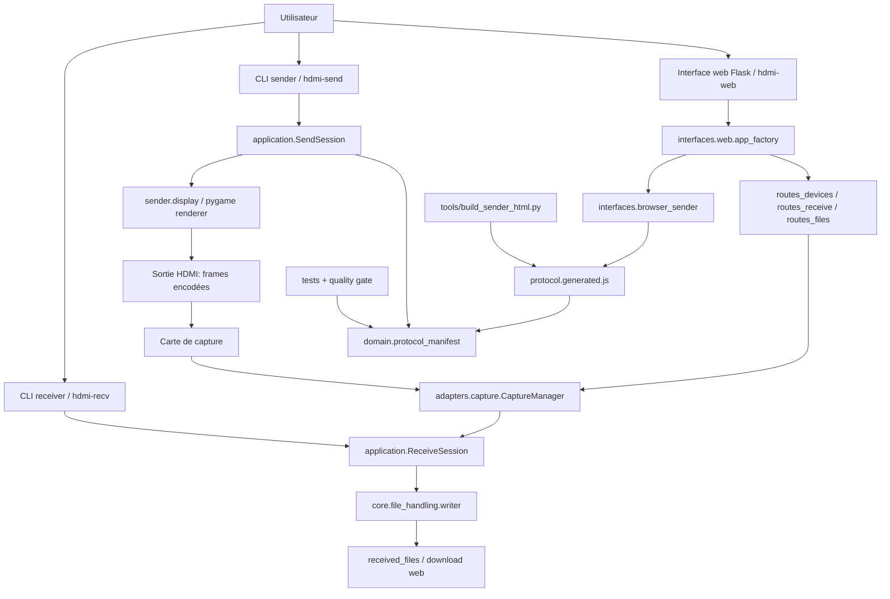
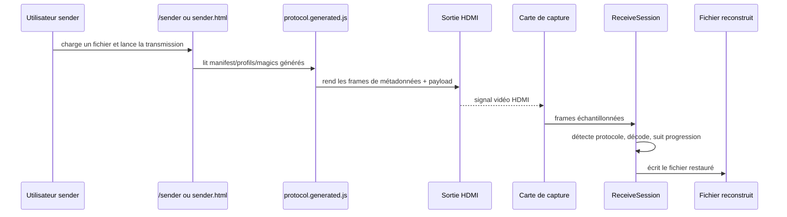
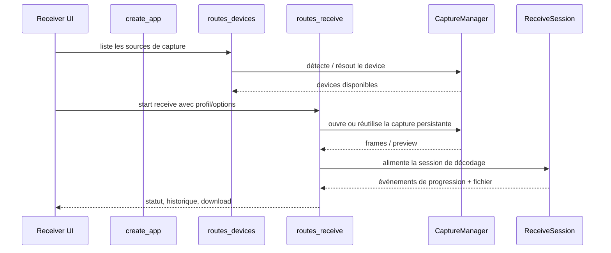

# Architecture — HDMI Transfer

## Objectif et périmètre

HDMI Transfer transfère un fichier sans réseau de données entre deux machines : le sender affiche des trames vidéo sur une sortie HDMI, puis le receiver lit ce signal via une carte de capture et reconstruit le fichier. La branche par défaut observée met l'accent sur un setup `2 PC` :

- `PC sender` : navigateur ou CLI qui rend les frames sur l'écran branché en HDMI ;
- `PC receiver` : machine qui pilote la carte de capture, décode le signal et expose l'interface web.

Le projet est en refactor type *strangler* : les modules canoniques vivent sous `src/domain`, `src/application`, `src/adapters` et `src/interfaces`, pendant que des shims legacy gardent les anciens imports utilisables.

## Vue d'ensemble



## Couches et responsabilités

| Couche | Rôle | Fichiers représentatifs |
|---|---|---|
| `domain` | Source de vérité protocolaire : manifest, modèles, profils, constantes exposées au Python et au sender navigateur. | `src/domain/protocol_manifest.py`, `src/domain/models.py` |
| `application` | Machines d'état d'envoi/réception, événements de progression et orchestration de session. | `src/application/send_session.py`, `src/application/receive_session.py`, `src/application/events.py` |
| `core` | Implémentation protocolaire et utilitaires partagés : fountain/sequential, PRNG, capture bas niveau, fichiers. | `src/core/protocols/*`, `src/core/file_handling/*`, `src/core/prng.py` |
| `adapters` | Ponts techniques vers le matériel ou les intégrations : registry de cartes de capture, capture persistante, résolution device. | `src/adapters/capture/*` |
| `interfaces` | CLI, Flask, preview HTTP et sender navigateur. Les interfaces appellent l'application au lieu de dupliquer la logique protocolaire. | `src/interfaces/cli/*`, `src/interfaces/web/*`, `src/interfaces/browser_sender/*` |
| `compat` + wrappers legacy | Réexport des anciens chemins pour ne pas casser les scripts existants. | `src/compat/imports.py`, `src/protocols/*`, `src/web/server.py` |
| `tools` | Génération et diagnostics. | `tools/build_sender_html.py`, `tools/diagnose_devices.py`, `tools/run_quality_gate.ps1` |

## Flux d'envoi `2 PC`



## Flux web receiver



## Données et fichiers persistants

Le projet n'a pas de base SQL. Les données persistantes sont des fichiers ou artefacts générés :

- payload source côté sender, jamais stocké en base ;
- fichiers reconstruits côté receiver, typiquement sous `received_files/` ou servis par les routes fichier ;
- `sender.html` et `src/interfaces/browser_sender/protocol.generated.js`, générés à partir du manifest ;
- assets web statiques sous `src/web/static/` ;
- `uv.lock`, `pyproject.toml` et scripts de gate qualité pour figer l'environnement.

`sender.html` est explicitement un artefact généré : toute modification protocolaire doit partir du manifest et des sources browser sender, puis exécuter `uv run python tools/build_sender_html.py` et `--check`.

## Protocoles

- `Fountain` est le mode robuste par défaut, recommandé avec le profil `Balanced` et `2 bpc`.
- `Sequential` reste disponible pour des cas plus simples ou du diagnostic.
- Les profils `speed`, `balanced` et `quality` changent résolution/FPS cibles et marge de signal.
- Le manifest protocolaire évite que la CLI, Flask et le sender navigateur divergent.

## Runtime et configuration

Installation recommandée :

```bash
uv sync --extra web      # receiver web
uv sync --extra all      # CLI sender + receiver + web
uv sync --extra dev      # tests et outils dev
```

Entrées principales :

```bash
uv run hdmi-web --host 0.0.0.0 --port 5000
uv run hdmi-send monfichier.zip --mode fountain --profile balanced --screen 1
uv run hdmi-recv 0 --mode fountain --profile balanced --output received_files
```

Le receiver web sert :

- `/` : UI receiver ;
- `/sender` : wrapper par défaut pour le setup `2 PC`, sans API receiver active côté sender ;
- `/sender/test` : wrapper de test `1 PC`, avec API locale ;
- `/sender/app` ou `sender.html` : sender standalone.

## Qualité et vérifications

Gate local canonique :

```powershell
uv run powershell -ExecutionPolicy Bypass -File tools/run_quality_gate.ps1
```

Sous Linux, les vérifications légères utiles sont :

```bash
uv run python tools/build_sender_html.py --check
uv run pytest -m "not hardware"
```

Les tests couvrent notamment les contrats protocole Python/browser, les sessions send/receive, le capture manager, les routes web, les budgets fountain, les wrappers legacy et les propriétés PRNG/RSD.

## Limites connues / points ouverts

- La validation hardware ne peut pas être prouvée en CI générique : elle dépend d'une vraie carte de capture, d'un écran/chemin HDMI et du refresh rate réel.
- Les shims legacy restent présents ; les nouvelles contributions doivent viser les chemins canoniques documentés ci-dessus.
- Le mode `Speed` n'apporte un gain que si tout le chemin HDMI tient réellement le refresh cible. Sinon, revenir à `Balanced + Fountain + 2 bpc`.
- La documentation de migration doit rester alignée tant que les wrappers legacy ne sont pas supprimés.
