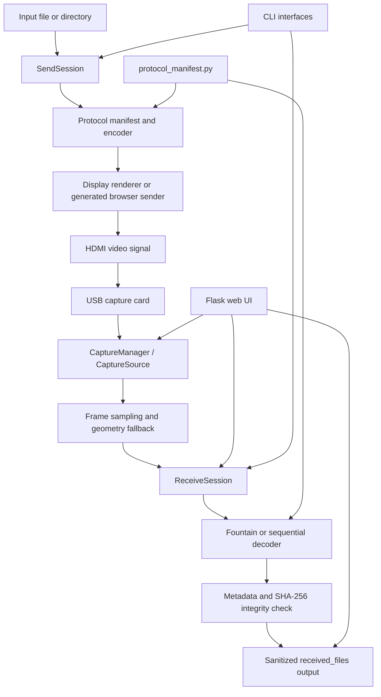
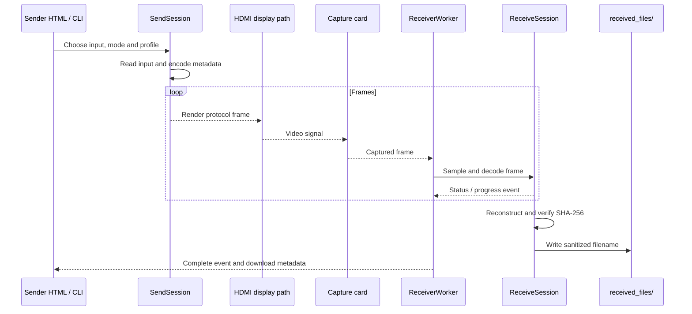
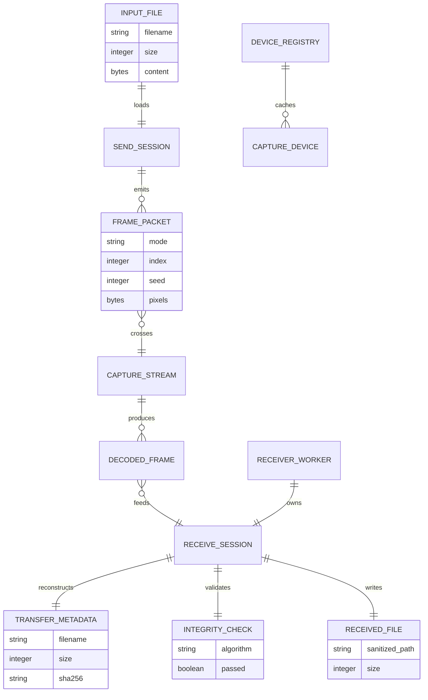

# HDMI Transfer — architecture

## Objective and scope

HDMI Transfer is an experimental proof of concept for moving a file between two computers through a video signal: a sender renders encoded frames on an HDMI output, an HDMI-to-USB capture card feeds the receiver, and the receiver reconstructs the file locally. The payload does not require a shared network.

This document describes the code on the default `main` branch at the time of writing. It is an implementation architecture document, not a promise that the hardware path is production-ready. The repository does not contain a separate PRD or formal SPEC; the README, source tree, tests, generated protocol assets and compose files are the current sources of truth.

## Global architecture



The project is split into a shared transfer engine and thin adapters:

- `src/domain/` contains protocol-facing models and the canonical manifest types.
- `src/application/` orchestrates send and receive sessions without knowing about Flask, CLI rendering or capture hardware.
- `src/core/` contains frame formats, protocols, sampling, file metadata and file handling.
- `src/adapters/` connects the application to capture devices and persistent device metadata.
- `src/interfaces/` exposes CLI commands, Flask routes and browser-sender assets.
- `src/sender/` renders frames to a local display; `src/receiver/` opens capture sources.
- `src/web/` runs the background receiver worker and packages static web assets.

## Main components and responsibilities

| Component | Responsibility | Important paths |
| --- | --- | --- |
| Protocol manifest | Defines frame constants, profiles, headers and protocol parameters shared by Python and browser code | `src/domain/protocol_manifest.py`, `src/core/constants.json` |
| Send session | Reads a file/directory, builds metadata, chunks payloads and yields sequential or fountain frame packets | `src/application/send_session.py` |
| Receive session | Detects/uses a protocol, consumes decoded frames, tracks progress and verifies completion | `src/application/receive_session.py` |
| Protocol implementations | Encode/decode sequential and fountain frames, including CRC and XOR operations | `src/core/protocols/` |
| File handling | Read input, build/parse metadata, write output and compare SHA-256 | `src/core/file_handling/` |
| Capture layer | Detect capture devices, cache device information, keep a persistent capture open and release it safely | `src/adapters/capture/`, `src/receiver/capture/` |
| Geometry/sampling | Accommodate scaled or letterboxed browser output before protocol decoding | `src/application/receive_geometry.py`, `src/core/capture/` |
| Receiver worker | Runs capture → sample → decode in a daemon thread, publishes status/progress/complete/error events and serves preview frames | `src/web/receiver_worker.py` |
| Flask application | Serves pages, device/profile APIs, receive controls, Server-Sent Events, preview and downloaded files | `src/interfaces/web/` |
| Browser sender | Offline-capable generated sender that follows the same wire protocol as Python | `sender.html`, `src/interfaces/browser_sender/`, `tools/build_sender_html.py` |
| CLI | Send, receive, calibrate, benchmark and console workflows for reproducible experiments | `src/interfaces/cli/`, `src/core/cli/` |

### Protocol and generated assets

`get_protocol_manifest()` is the canonical source for profiles and protocol constants. The built-in profiles are:

- `balanced`: 1920×1080 at 60 FPS;
- `speed`: 1920×1080 at 240 FPS, subject to the display and capture chain;
- `quality`: 3840×2160 at 30 FPS.

The sender build tool generates the standalone `sender.html` and browser protocol JavaScript from the shared manifest and browser sources. The generated file should not be edited by hand; use `tools/build_sender_html.py` and its `--check` mode.

The two transfer modes are:

- **Sequential**: start metadata, ordered data frames and an end frame. The receiver can report a partial sequential transfer when the adapter stops after the expected data has arrived.
- **Fountain**: metadata plus droplets generated from chunks with a deterministic seed. The receiver uses enough independent droplets to reconstruct the chunks despite frame loss, then checks the declared size and digest.

## Key interactions

### Browser or CLI transfer



### Web receiver lifecycle

The Flask factory creates a `CaptureManager`, a cached `DeviceRegistry` and a receiver control lock. `/api/devices` returns cached devices or re-detects them; `/api/devices/warm` primes a persistent capture. `/api/receive/start` resolves the logical device to an OS/backend target, waits for the persistent capture where applicable, then starts one `ReceiverWorker`. The worker publishes events to subscriber queues consumed by `/api/receive/events` as Server-Sent Events. Stop/reset releases the worker and capture resources.

The important web routes are:

- `GET /`, `/history`, `/settings`, `/sender`, `/sender/test`, `/sender/app`: static receiver, history, settings and sender pages.
- `GET /api/devices`, `POST /api/devices/warm`: device detection/cache and capture warm-up.
- `GET /api/profiles`: protocol profile metadata for the UI.
- `POST /api/receive/start`, `/api/receive/stop`, `/api/receive/reset`: receiver lifecycle.
- `GET /api/receive/status`, `/api/receive/events`, `/api/receive/preview`: status, progress stream and MJPEG preview.
- `POST /api/receive/preview/settings`: preview quality, scale and FPS tuning.
- `GET /api/receive/files`, `/api/receive/file/<filename>`: list, inspect or delete received files.
- `GET /api/receive/download/<filename>` and `POST .../reveal`: download or reveal a received file locally.

## Data and persistence

There is no database or remote application service. The runtime persists data in the filesystem:

- `received_files/` stores reconstructed payloads. Output filenames are reduced to `os.path.basename`, preventing directory components from becoming output paths.
- `src/web/.device_cache.json` stores detected device metadata when the web runtime is used. It is a local cache, not protocol state.
- The Flask process holds the active `ReceiverWorker`, subscriber queues, preview frame and capture manager in memory.
- Protocol metadata travels inside transfer frames and includes enough information to recover the filename, size and expected SHA-256 digest.
- Generated `sender.html` and `protocol.generated.js` are repository artifacts derived from the manifest; they are not runtime databases.



## Runtime, deployment and configuration

### Native runtime

Install Python 3.11 or newer and the desired `uv` extra from `pyproject.toml`:

```bash
uv sync --locked --extra web
uv run --no-sync hdmi-web
```

The web entry point defaults to `127.0.0.1:5000`; `--host 0.0.0.0` exposes it to a trusted LAN. The native launchers create/use `.venv` and start the same web application. The sender can also be opened as a standalone local HTML file.

### Docker runtime

`Dockerfile` builds a Python 3.11 image with the web/receiver/docker extras, OpenCV shared libraries and a non-root `hdmi` user. The container exposes port `5000`, serves through `docker/serve.py`, and has a healthcheck against `/api/receive/status`. `compose.yaml` publishes `127.0.0.1:5000` by default and persists `received_files` in a named volume. `compose.capture.yaml` is an optional Linux capture-card overlay that maps the host video device and requires the group ID owning it.

Relevant configuration is explicit in compose or CLI arguments rather than a database. The main operational choices are host/port, capture device/backend, profile, protocol mode, bits per channel, output directory and optional preflight. Use the capture overlay only on a host where `/dev/video*` is the intended device; Windows capture-card handling uses the platform-specific device registry/backends.

## Verification and development workflow

The repository provides unit, contract, performance and optional hardware tests. The lightweight checks for a documentation change are:

```bash
uv run python tools/build_sender_html.py --check
uv run pytest -m 'not hardware and not slow'
```

The full quality gate is platform-aware and lives in `tools/run_quality_gate.ps1`. Hardware E2E tests and live throughput tests require the actual display/capture chain and cannot be proven by a Linux documentation job. A Docker smoke run validates the web container, not HDMI throughput.

## Known limits and open points

- This remains a POC. The README's transfer rates are theoretical encoded-payload ceilings; useful throughput depends on display refresh, capture-card behavior, dropped frames, decoding overhead and redundancy.
- HDMI video encoding and fountain codes do not encrypt the payload. Encrypt sensitive files before transmission.
- Capture backends, device indexes, OpenCV behavior and refresh rates are platform/hardware dependent. A profile name cannot make unsupported hardware operate at that rate.
- The web receiver exposes received files and has no built-in authentication layer. Bind it to loopback or a trusted LAN and place any public exposure behind an appropriate access control layer.
- Output file writes are sanitized but are not a content scanning or quota system; operators must manage disk space and untrusted payloads.
- The device cache and active capture state are local process state. Multiple concurrent web instances sharing the same device/output directory are not a supported coordination model.
- The browser sender is generated from shared protocol inputs, but a sender copied from an older checkout may be incompatible with a newer receiver. Rebuild and distribute the generated asset together with the protocol changes.
- The repository contains optional hardware tests, but no automated CI runner can replace validation with the target HDMI output, capture card and receiver OS.

## Sources consulted

- `README.md`, `pyproject.toml`, `Dockerfile`, `compose.yaml`, `compose.capture.yaml`, `sender.html`;
- `src/domain/protocol_manifest.py`, `src/domain/models.py`, `src/application/send_session.py`, `src/application/receive_session.py`;
- `src/application/receive_geometry.py`, `src/adapters/capture/`, `src/receiver/capture/`;
- `src/interfaces/web/`, `src/web/receiver_worker.py`, `src/core/file_handling/`, `src/core/protocols/`;
- `tests/`, `tools/build_sender_html.py`, `tools/run_quality_gate.ps1` and `docs/getting-started.md`.

No clearly obsolete document was deleted. The existing `docs/architecture.md` was expanded in place to avoid creating a duplicate architecture file while preserving existing links and the repository's current lowercase naming.